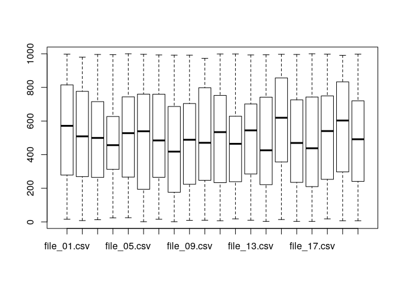
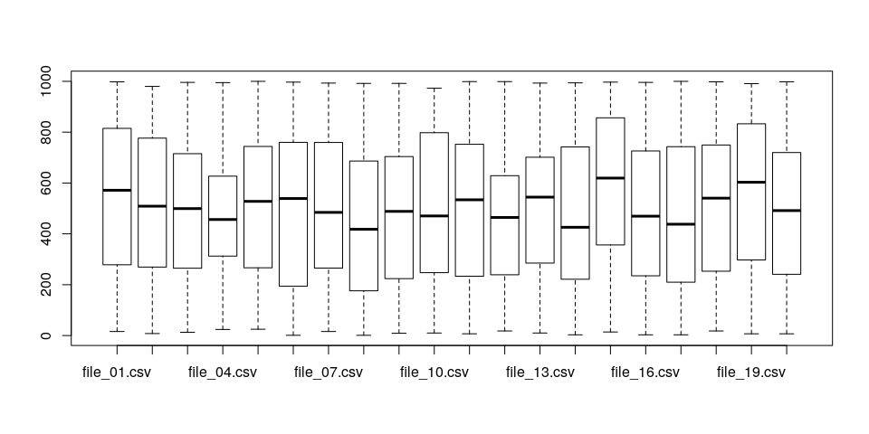

[Click here to return to the main README file.](./README.md)

Introduction
------------

This example imports the CSV files, using a more complex functionals
approach than what we saw in [functionals.md](./functionals.md). It is
more complex, because it uses a custom written function. This function,
`import_data()` imports a CSV file and creates a new column called
file\_name to show which file the data came from. If you would like to
see how this function works, see [here](./R/import_data.R). I'm going to
keep this document simple, and just focus on solving the first extra
credit challenge.

The other code is similar to what you've seen before, but is less
documented.

    ## Init ------------------------------------------------------------------------
    ## I always put my custom functions in a folder called R. Just a habit.
    source("R/import_data.R")
    library(dplyr)
    library(pander)
    if (exists("foo_data")) rm(foo_data)
    csv_files <- dir("data/", pattern="csv", full.names = TRUE)

    ## Imports the CSV data --------------------------------------------------------
    foo_data <-  bind_rows(lapply(X=csv_files, FUN=import_data))

At this point, we have a data.frame called `foo_data` with
`r nrow(foo_data)` rows of data, just like we did in the other examples.

Extra Credit \#1
----------------

There are several numeric columns of data. These columns were made by
sampling a sequence of numbers. But I made an error in one file and
there is a column of data with a different average in that file than in
any other file. Can you figure out which file I made the error in?

    ## I only need to look at integer columns, because I am told the error is in
    ## on of these columns. So, I need to figure out which columns are integers and
    ## now characters.
    column_types <- sapply(foo_data, typeof)
    ## Only interested in the first three columns.
    column_integers <- which(column_types == "integer")

    ## This lets us keep only the integer columns and the file_name column.
    columns_to_select <- c(column_integers,which(names(foo_data) == "file_name"))

    file_means <- foo_data %>%
        select(columns_to_select) %>%
        group_by(file_name) %>%
        summarize_all(mean)

    pander(data.frame(file_means), caption="These files all have similar means.")

<table style="width:69%;">
<caption>These files all have similar means.</caption>
<colgroup>
<col width="16%" />
<col width="16%" />
<col width="18%" />
<col width="18%" />
</colgroup>
<thead>
<tr class="header">
<th align="center">file_name</th>
<th align="center">first_col</th>
<th align="center">second_col</th>
<th align="center">third_col</th>
</tr>
</thead>
<tbody>
<tr class="odd">
<td align="center">file_01.csv</td>
<td align="center">40.68</td>
<td align="center">257.9</td>
<td align="center">532.6</td>
</tr>
<tr class="even">
<td align="center">file_02.csv</td>
<td align="center">41.01</td>
<td align="center">262.2</td>
<td align="center">512.8</td>
</tr>
<tr class="odd">
<td align="center">file_03.csv</td>
<td align="center">44.48</td>
<td align="center">271.7</td>
<td align="center">500.9</td>
</tr>
<tr class="even">
<td align="center">file_04.csv</td>
<td align="center">39.38</td>
<td align="center">253.9</td>
<td align="center">460.7</td>
</tr>
<tr class="odd">
<td align="center">file_05.csv</td>
<td align="center">43.97</td>
<td align="center">259.9</td>
<td align="center">518.2</td>
</tr>
<tr class="even">
<td align="center">file_06.csv</td>
<td align="center">44.08</td>
<td align="center">237.6</td>
<td align="center">498.3</td>
</tr>
<tr class="odd">
<td align="center">file_07.csv</td>
<td align="center">46.46</td>
<td align="center">237.4</td>
<td align="center">515.8</td>
</tr>
<tr class="even">
<td align="center">file_08.csv</td>
<td align="center">38.3</td>
<td align="center">247.4</td>
<td align="center">436.2</td>
</tr>
<tr class="odd">
<td align="center">file_09.csv</td>
<td align="center">39.64</td>
<td align="center">224.3</td>
<td align="center">474.5</td>
</tr>
<tr class="even">
<td align="center">file_10.csv</td>
<td align="center">39.18</td>
<td align="center">237.1</td>
<td align="center">499.8</td>
</tr>
<tr class="odd">
<td align="center">file_11.csv</td>
<td align="center">44.78</td>
<td align="center">248.9</td>
<td align="center">505</td>
</tr>
<tr class="even">
<td align="center">file_12.csv</td>
<td align="center">41.96</td>
<td align="center">231.2</td>
<td align="center">450.4</td>
</tr>
<tr class="odd">
<td align="center">file_13.csv</td>
<td align="center">42.97</td>
<td align="center">261.1</td>
<td align="center">497.8</td>
</tr>
<tr class="even">
<td align="center">file_14.csv</td>
<td align="center">44.14</td>
<td align="center">247.6</td>
<td align="center">465.3</td>
</tr>
<tr class="odd">
<td align="center">file_15.csv</td>
<td align="center">39.77</td>
<td align="center">240.6</td>
<td align="center">583.2</td>
</tr>
<tr class="even">
<td align="center">file_16.csv</td>
<td align="center">45.96</td>
<td align="center">242.8</td>
<td align="center">484.7</td>
</tr>
<tr class="odd">
<td align="center">file_17.csv</td>
<td align="center">40.37</td>
<td align="center">222.4</td>
<td align="center">473.4</td>
</tr>
<tr class="even">
<td align="center">file_18.csv</td>
<td align="center">39.4</td>
<td align="center">239</td>
<td align="center">523.2</td>
</tr>
<tr class="odd">
<td align="center">file_19.csv</td>
<td align="center">40.85</td>
<td align="center">263</td>
<td align="center">557.4</td>
</tr>
<tr class="even">
<td align="center">file_20.csv</td>
<td align="center">41.92</td>
<td align="center">268.1</td>
<td align="center">487.6</td>
</tr>
</tbody>
</table>

    file_sd <- foo_data %>%
        select(columns_to_select) %>%
        group_by(file_name) %>%
        summarize_all(sd)

    pander(data.frame(file_sd), caption="But not the same standard deviation.")

<table style="width:69%;">
<caption>But not the same standard deviation.</caption>
<colgroup>
<col width="16%" />
<col width="16%" />
<col width="18%" />
<col width="18%" />
</colgroup>
<thead>
<tr class="header">
<th align="center">file_name</th>
<th align="center">first_col</th>
<th align="center">second_col</th>
<th align="center">third_col</th>
</tr>
</thead>
<tbody>
<tr class="odd">
<td align="center">file_01.csv</td>
<td align="center">26.46</td>
<td align="center">145</td>
<td align="center">303.1</td>
</tr>
<tr class="even">
<td align="center">file_02.csv</td>
<td align="center">27.95</td>
<td align="center">147.4</td>
<td align="center">293.7</td>
</tr>
<tr class="odd">
<td align="center">file_03.csv</td>
<td align="center">28.21</td>
<td align="center">140.7</td>
<td align="center">279.9</td>
</tr>
<tr class="even">
<td align="center">file_04.csv</td>
<td align="center">24.06</td>
<td align="center">142.2</td>
<td align="center">210.3</td>
</tr>
<tr class="odd">
<td align="center">file_05.csv</td>
<td align="center">30.47</td>
<td align="center">133.6</td>
<td align="center">290.6</td>
</tr>
<tr class="even">
<td align="center">file_06.csv</td>
<td align="center">28.77</td>
<td align="center">140.7</td>
<td align="center">300.9</td>
</tr>
<tr class="odd">
<td align="center">file_07.csv</td>
<td align="center">26.4</td>
<td align="center">141.9</td>
<td align="center">283.6</td>
</tr>
<tr class="even">
<td align="center">file_08.csv</td>
<td align="center">25.62</td>
<td align="center">143.7</td>
<td align="center">299.1</td>
</tr>
<tr class="odd">
<td align="center">file_09.csv</td>
<td align="center">25.48</td>
<td align="center">141.1</td>
<td align="center">286.6</td>
</tr>
<tr class="even">
<td align="center">file_10.csv</td>
<td align="center">27.19</td>
<td align="center">141.4</td>
<td align="center">291.2</td>
</tr>
<tr class="odd">
<td align="center">file_11.csv</td>
<td align="center">27.57</td>
<td align="center">150.7</td>
<td align="center">285.8</td>
</tr>
<tr class="even">
<td align="center">file_12.csv</td>
<td align="center">26.93</td>
<td align="center">155</td>
<td align="center">259.9</td>
</tr>
<tr class="odd">
<td align="center">file_13.csv</td>
<td align="center">28.46</td>
<td align="center">146.3</td>
<td align="center">270</td>
</tr>
<tr class="even">
<td align="center">file_14.csv</td>
<td align="center">29.92</td>
<td align="center">135.8</td>
<td align="center">291.7</td>
</tr>
<tr class="odd">
<td align="center">file_15.csv</td>
<td align="center">26.47</td>
<td align="center">154.1</td>
<td align="center">295</td>
</tr>
<tr class="even">
<td align="center">file_16.csv</td>
<td align="center">32.24</td>
<td align="center">153</td>
<td align="center">295.2</td>
</tr>
<tr class="odd">
<td align="center">file_17.csv</td>
<td align="center">28</td>
<td align="center">142.9</td>
<td align="center">297.8</td>
</tr>
<tr class="even">
<td align="center">file_18.csv</td>
<td align="center">23.37</td>
<td align="center">146.8</td>
<td align="center">299.3</td>
</tr>
<tr class="odd">
<td align="center">file_19.csv</td>
<td align="center">30.36</td>
<td align="center">133.2</td>
<td align="center">297</td>
</tr>
<tr class="even">
<td align="center">file_20.csv</td>
<td align="center">27.07</td>
<td align="center">147.7</td>
<td align="center">299.4</td>
</tr>
</tbody>
</table>

    boxplot(third_col~as.factor(file_name), data=foo_data)

To be fair, this was really tricky. I had actually intended the average
to be different, and not just the standard deviation, but I messed up a
little when I created the raw code. Sorry! It is a little easier to see
in a box plot.

    boxplot(third_col~as.factor(file_name), data=foo_data)

Extra Credit \#2
----------------

Using basic descriptive statistics, what can you tell me about the data
columns?

    ## OK - I should have called this Extra Credit #1.
    ## This is much easier than the first challenge.
    ## Sorry.
    summary(foo_data)

    ##    first_col        second_col      third_col       fourth_col       
    ##  Min.   :  1.00   Min.   :  1.0   Min.   :   1.0   Length:2000       
    ##  1st Qu.: 19.00   1st Qu.:125.0   1st Qu.: 253.0   Class :character  
    ##  Median : 38.00   Median :244.5   Median : 499.0   Mode  :character  
    ##  Mean   : 41.97   Mean   :247.7   Mean   : 498.9                     
    ##  3rd Qu.: 61.00   3rd Qu.:372.0   3rd Qu.: 742.0                     
    ##  Max.   :100.00   Max.   :500.0   Max.   :1000.0                     
    ##   fifth_col          file_name        
    ##  Length:2000        Length:2000       
    ##  Class :character   Class :character  
    ##  Mode  :character   Mode  :character  
    ##                                       
    ##                                       
    ##
